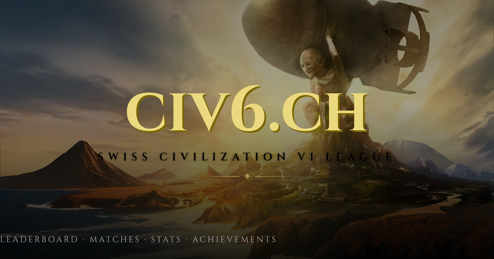
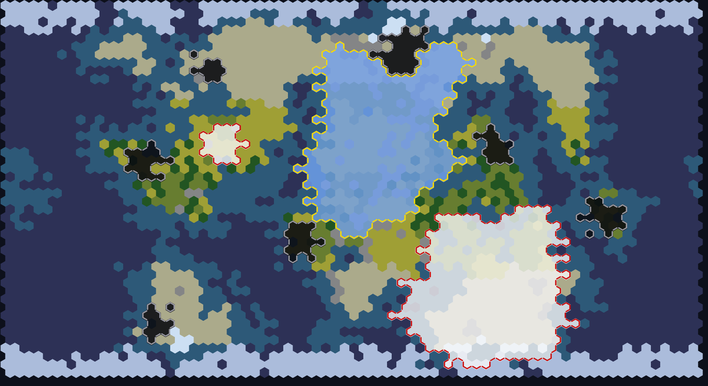

# civ6.ch

**A Swiss Civilization VI league** — live at [civ6.ch](https://civ6.ch)

A ranked ladder for a private Civ6 group: players upload their save files, the server parses the proprietary binary format directly, and every match feeds a Glicko-2 rating, a leaderboard, and a set of tongue-in-cheek achievements.

## What it does

- **Parses raw `.Civ6Save` files** — a custom binary reader recovers the zlib-compressed game state buried inside the save container (byte-anchored, no official spec), extracting players, cities, districts, wonders, religions, victories, and full map tile data.
- **Renders the map** from that parsed state — a from-scratch, anti-aliased hex-grid image generator draws terrain, territory borders, and city-states as a PNG, straight from the save bytes.
- **Rates players with Glicko-2** ("Glicko-Civ"), extended with custom adjustments for FFA and team games, team-size imbalance, and active in-game "denouncements".
- **Tracks a leaderboard, match history, per-player profiles, stats, and achievements**, with Steam login for auth.

## Stack

- **Backend**: Go — binary save parsing, Glicko rating engine, image rendering, REST API
- **Frontend**: SvelteKit + Tailwind
- **Storage**: Postgres for game/rating data, pluggable local/S3 object storage for save files and rendered maps
- **Infra**: NixOS module + flake for reproducible deploys

## Screenshots

Map rendered entirely from a parsed save file — terrain, city yields, player stats, religion, and more:

## License

AGPL-3.0
